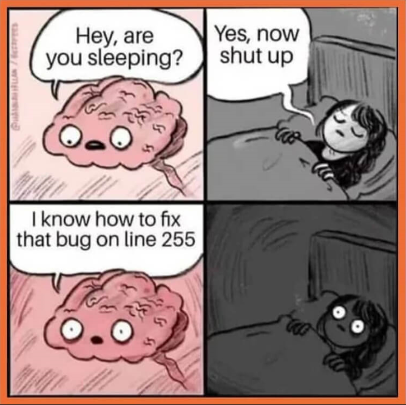
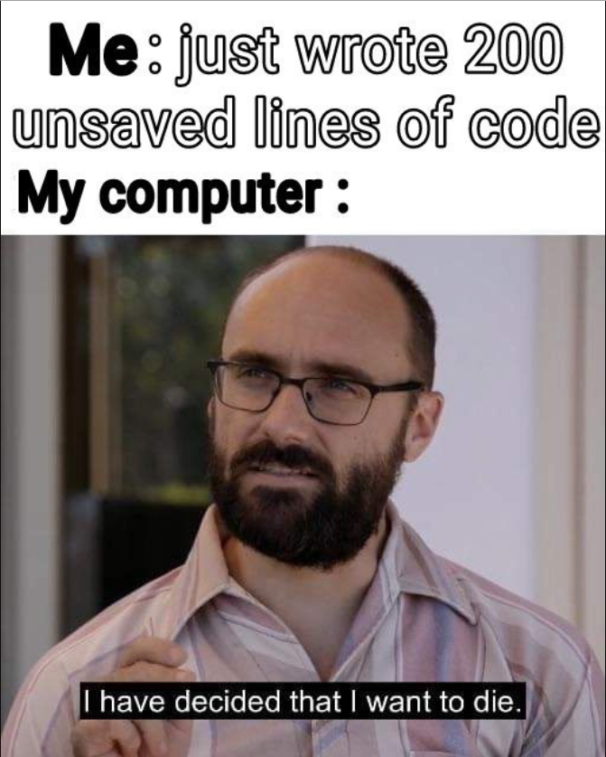

# Welcome to Nataly's Homepage!
*[Skip to Computer Science](#computer-science)* | *[Skip to Other Interests](#other-interests)* | *[Skip to Memes](#memes)*


I'm Nataly Buhr, a sophomore student at UCSD in pursuit of a B.S. in Computer Science. Feel free to keep reading/skip ahead if you want to get to know a little more about my interests in and outside of computer science, or if you just want to see some CS memes!


### Computer Science
I'm currently interested in learning about UX design and web/software development. In the future, I hope to put my education to use in creating easy-to-navigate websites or supporting the development of other applications that add a bit more convenience to people's lives.

To this end, I'm working towards:
- improving my soft skills such as teamwork, communication, and attention to detail
- improving my technical skills in using scripting languages and designing test cases
- meeting professional standards, both with my academic assignments and personal projects


I also participate in a few clubs ([Girls Who Code](https://girlswhocode.com/), [Society of Women Engineers](https://swe.org/), [Empowerment and Development for Girls in Engineering](https://edgeucsd.wixsite.com/edge)) that focus on encouraging young women to engage in STEM subjects, as well as supporting current female students pursuing degrees in them.


### Other Interests
Outside of my studies, I love spending my time playing RPGs and discovering new anime! The game I enjoy playing most right now is *Genshin Impact*, and this is the list of anime I'm slowly finishing off this season:
- [x] *Attack on Titan*
- [x] *Jujutsu Kaisen*
- [ ] *The Promised Neverland*
- [ ] *Horimiya*


### Memes


To close off this page, here are some (bad) jokes and memes for your enjoyment:


```
if (you.laughAt(this)) {
    return areYouOkayMessage;
}
```








> **Thanks for reading this far!**
